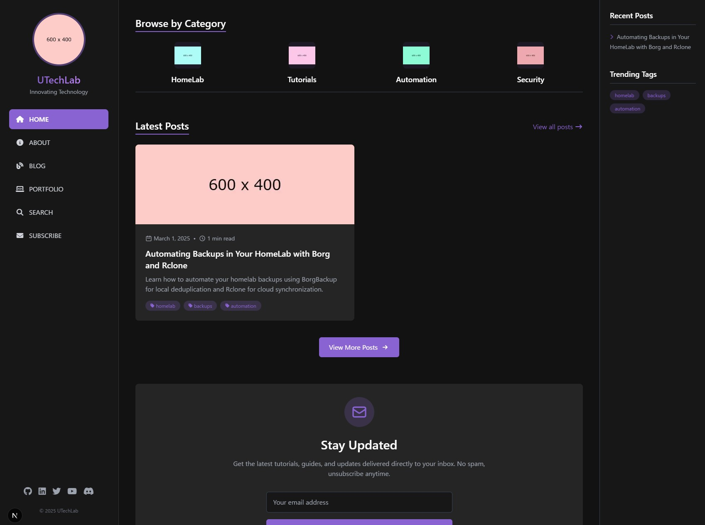

# UTechLab - Modern Blog & Portfolio Template

A modern, customizable blog and portfolio website built with Next.js, Tailwind CSS, and MDX. Perfect for tech enthusiasts, developers, and creators who want to share their knowledge and showcase their projects.



## Features

- 🎨 **Modern dark-themed design** optimized for tech content
- 📱 **Fully responsive** with dedicated mobile navigation
- ✍️ **MDX-based blog** with syntax highlighting
- 📑 **Automatic table of contents** for blog posts
- 💬 **Giscus comments integration** (GitHub Discussions)
- 🔍 **Search functionality** for blog posts
- 📂 **Category-based content browsing**
- 🏷️ **Tag filtering system**
- 📧 **Email newsletter subscription form**
- 🔄 **Light/dark mode toggle**
- 📊 **Timeline-based portfolio page**

## Getting Started

### Prerequisites

- Node.js 14.x or higher
- npm or yarn

### Installation

Clone this repository:

```
git clone https://github.com/yourusername/utech-lab-template.git
cd utech-lab-template
```

Install dependencies:

```
npm install
# or
yarn install
```

Start the development server:

```
npm run dev
# or
yarn dev
```

Open [http://localhost:3000](http://localhost:3000) in your browser.

## Customization

### Site Configuration

The main configuration file is located at `lib/siteConfig.ts`. Here you can customize:

- Site title and description
- Author information
- Navigation links
- Content categories
- Social media links
- Comments settings
- Newsletter configuration

**Example:**

```typescript
export const siteConfig = {
  title: 'UTechLab',
  description: 'Innovating Technology',
  siteUrl: 'https://www.your-domain.com',
  
  // Author information
  author: {
    name: 'Your Name',
    avatar: '/images/profile.jpg',
    bio: 'Tech enthusiast and self-hosting advocate',
  },
  
  // Navigation links, categories, and more...
}
```

### Theme Customization

You can customize colors, fonts, and other design elements by editing:

- `tailwind.config.js` - For global theme settings
- `styles/globals.css` - For global CSS styles

The main colors are defined in the Tailwind config:

```js
colors: {
  primary: {
    DEFAULT: '#8a63d2', // Main accent color
    dark: '#645986',    // Darker variant
  },
  dark: {
    bg: '#121212',      // Background color
    card: '#252525',    // Card background
    sidebar: '#171717', // Sidebar background
    border: '#333333',  // Border color
  },
  // Light mode colors...
}
```

## Content Management

### Adding Blog Posts

Create blog posts by adding `.mdx` files to the `content/blog` directory. Each post should have frontmatter like this:

```md
---
title: Your Blog Post Title
date: '2025-03-01'
description: A brief description of your post
image: /images/blog/your-cover-image.jpg
tags: ['homelab', 'docker', 'self-hosted']
---

Your markdown content goes here. You can use **bold**, *italic*, and other markdown formatting.

## Headings will automatically show up in the table of contents

Code blocks with syntax highlighting:

```bash
npm install my-package
```
```

### Creating Category Icons

For each category defined in `siteConfig.ts`, add an icon:

- Create a PNG image (ideally 64x64px with a transparent background)
- Place it in `/public/images/categories/`
- Name it to match the category slug (e.g., `homelab.png`, `security.png`)

### Portfolio Timeline

Edit the timeline content in `pages/portfolio.tsx` or create a dedicated data file:

```typescript
const timelineEvents = [
  {
    id: '1',
    date: '2023-05-15',
    title: 'Project Title',
    description: 'Description of your project or milestone',
    images: ['/images/portfolio/project1.jpg'],
    tags: ['react', 'aws'],
    side: 'right',
  },
  // More timeline events...
];
```

## Page Structure

The template includes the following pages:

- `pages/index.tsx` - Homepage with categories and latest posts
- `pages/blog/index.tsx` - Blog listing with tag filtering
- `pages/blog/[slug].tsx` - Individual blog post template
- `pages/blog/category/[category].tsx` - Category-filtered posts
- `pages/blog/tag/[tag].tsx` - Tag-filtered posts
- `pages/portfolio.tsx` - Portfolio with timeline
- `pages/about.tsx` - About page
- `pages/search.tsx` - Search functionality
- `pages/subscribe.tsx` - Newsletter subscription

## Components

The template is built with a component-based architecture:

- **Layout Components:** Main layout, sidebar, header, footer
- **Blog Components:** Blog card, table of contents, comments
- **UI Components:** Buttons, tags, theme toggle, search bar
- **Portfolio Components:** Timeline display
- **Form Components:** Subscribe form, search form

## Blog Features

### Code Blocks with Syntax Highlighting

The template includes beautiful syntax highlighting for code blocks using Prism.js. Just use regular markdown code fences with a language specifier:

```jsx
// This will be highlighted as JSX code
function Example() {
  return <div>Hello World</div>;
}
```

## Setting Up Comments

The template uses Giscus for comments. To set it up:

1. Go to [https://giscus.app/](https://giscus.app/).
2. Follow the instructions to set up Giscus for your GitHub repository.
3. Update the configuration in `lib/siteConfig.ts`:

```typescript
comments: {
  provider: 'giscus',
  giscusConfig: {
    repo: 'yourusername/yourrepo',
    repoId: 'YOUR_REPO_ID',
    category: 'Announcements',
    categoryId: 'YOUR_CATEGORY_ID',
  },
},
```

## Setting Up Newsletter

The template includes a newsletter subscription form. To hook it up:

- Choose an email service (Mailchimp, ConvertKit, etc.)
- Create an API endpoint in `pages/api/subscribe.ts`
- Update the form submission in `pages/subscribe.tsx`

## Deployment

### Deploying to Vercel

1. Push your repository to GitHub.
2. Go to Vercel and import your repository.
3. Click **Deploy**.

### Deploying to Netlify

1. Push your repository to GitHub.
2. Go to Netlify and select **New site from Git**.
3. Select your repository and click **Deploy site**.

## Advanced Customization

### Custom Fonts

To use custom fonts:

1. Import the font in `styles/globals.css`.
2. Update the font family in `tailwind.config.js`.

### Adding New Components

To create new components:

1. Create a file in the appropriate directory under `components/`.
2. Import and use the component in your pages.

### Analytics

To add Google Analytics or other analytics services:

- Update the analytics section in `lib/siteConfig.ts`.
- Add the tracking code to `pages/_app.tsx`.

### SEO Optimization

The template includes basic SEO best practices:

- Title and meta description for all pages
- OpenGraph tags for social sharing
- Sitemap generation
- Structured data

## Troubleshooting

### Common Issues

- **Images not showing:** Ensure image paths are correct and the files exist in the `public` directory.
- **Styles not applying:** Verify that the Tailwind classes are correct and the CSS is properly imported.
- **MDX parsing errors:** Check that your MDX files have correct frontmatter and valid markdown syntax.

## Contributing

Contributions are welcome! Please feel free to submit a Pull Request.

## License

This project is licensed under the MIT License - see the [LICENSE](./LICENSE) file for details.

## Acknowledgments

- [Next.js](https://nextjs.org/)
- [Tailwind CSS](https://tailwindcss.com/)
- [MDX](https://mdxjs.com/)
- [Framer Motion](https://www.framer.com/motion/)
- [Font Awesome](https://fontawesome.com/)
- [Giscus](https://giscus.app/)

## Support

If you need help, please open an issue or contact [your-email@example.com](mailto:your-email@example.com).

---

## File Structure Reference

```
my-portfolio-site/
├── components/
│   ├── blog/
│   │   ├── BlogCard.tsx
│   │   ├── BlogMeta.tsx
│   │   ├── GiscusComments.tsx
│   │   └── TableOfContents.tsx
│   ├── home/
│   │   └── FeaturedPosts.tsx
│   ├── layout/
│   │   ├── Footer.tsx
│   │   ├── Layout.tsx
│   │   ├── MobileMenu.tsx
│   │   ├── RightSidebar.tsx
│   │   └── Sidebar.tsx
│   ├── portfolio/
│   │   ├── Timeline.tsx
│   │   └── TimelineItem.tsx
│   └── ui/
│       ├── BackToTop.tsx
│       ├── Button.tsx
│       ├── SearchBar.tsx
│       ├── Tag.tsx
│       └── ThemeToggle.tsx
├── content/
│   └── blog/
│       ├── automating-backups.mdx
│       └── ... (other blog posts)
├── lib/
│   ├── mdx.ts
│   └── siteConfig.ts
├── pages/
│   ├── _app.tsx
│   ├── _document.tsx
│   ├── index.tsx
│   ├── about.tsx
│   ├── blog/
│   │   ├── index.tsx
│   │   ├── [slug].tsx
│   │   ├── category/
│   │   │   └── [category].tsx
│   │   └── tag/
│   │       └── [tag].tsx
│   ├── portfolio.tsx
│   ├── search.tsx
│   └── subscribe.tsx
├── public/
│   └── images/
│       ├── categories/
│       │   ├── homelab.png
│       │   ├── tutorials.png
│       │   ├── automation.png
│       │   └── security.png
│       ├── about-cover.jpg
│       ├── placeholder.jpg
│       └── profile.jpg
├── styles/
│   └── globals.css
├── next.config.js
├── package.json
├── README.md
└── tailwind.config.js
```

---

## Quick Start Blog Post Template

Here's a template you can use for creating new blog posts:

```md
---
title: Your Post Title
date: '2025-03-05'
description: A brief description of what this post is about
image: /images/blog/your-post-cover.jpg
tags: ['tag1', 'tag2', 'tag3']
---

## Introduction

Start with an introduction to your topic. Explain what readers will learn or what problem this post solves.

## Section One

Your main content goes here. You can use **bold text**, *italic text*, and other Markdown formatting.

### Subsection

More detailed information can go in subsections.

## Code Examples

```bash
# Your code example here
npm install package-name
```

## Tips and Best Practices

- Point one
- Point two
- Point three

## Conclusion

Summarize what the reader should have learned and suggest next steps.
```

*Remember to create the appropriate image files referenced in your post and place them in the `public/images` directory.*


```
---

## Support

If you need help, please open an issue or contact [chikara.inohara@utechjapan.net](mailto:your-email@example.com).

Enjoy customizing your UTechLab template!