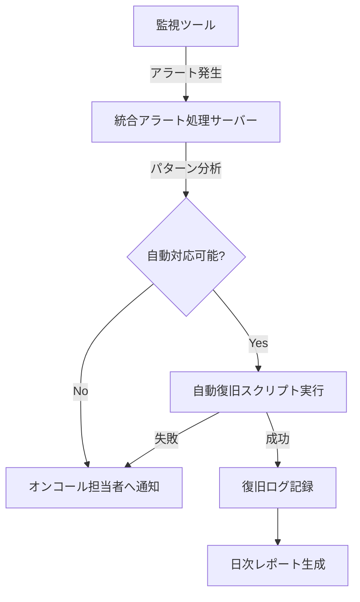

# 現場で実践！ネットワーク監視システムの改善ポイント 〜自治体インフラSEの体験談〜

こんにちは、井ノ原力です。現在、公共機関向けネットワークとサーバーの監視システム構築・運用を担当しています。CCNA、LPIC、クラウド関連の資格を活かした実務経験をもとに、今回は**実際の現場で直面した監視システムの課題と、その改善に向けた取り組み**についてお伝えします。

理想論ではなく「現場でどう動くか」の視点で、具体的な事例と解決策をご紹介します。自治体システムならではの難しさや、限られたリソースの中での工夫など、同じような課題に直面している方々の参考になれば幸いです。

[images/monitoring-dashboard.jpg]

## 1. 監視システムの現状と課題 〜私が直面した壁〜

### 自治体向け監視システムの特殊事情

派遣先の自治体では、数百台のサーバーとネットワーク機器を**3名のチーム**で監視・運用する必要がありました。以下のような課題に直面しましたが、皆さんの職場でも似たような状況はないでしょうか？

- **アラート疲れ**: 日に100件以上の通知が来るため、重要な警告を見逃すリスク
- **複数システム間の連携不足**: 複数の監視ツールが並行稼働し、情報が分断
- **障害対応の属人化**: 特定のベテラン職員しか対応できない状況
- **予算と人材の制約**: 高価な商用ツールやクラウドサービスの導入が難しい

特に印象的だったのは、**「監視しているはずなのに、ユーザーからの問い合わせで障害を知る」**という皮肉な状況でした。これは監視の意義自体を問い直す出来事でした。

## 2. 改善策の具体例 〜試行錯誤の記録〜

課題解決のために3フェーズに分けて取り組みました。ここでは具体的な実装方法とその効果、さらには失敗から学んだ教訓までご紹介します。

### フェーズ1：監視ルールの最適化による「アラート疲れ」対策

#### 具体的な取り組み

**1. 監視対象の棚卸しと分類**

まず始めたのは、全監視対象の棚卸しと重要度分類でした。

```
【監視対象の分類】
S: 市民サービスに直結するシステム（即時対応）
A: 業務に重大な影響がある内部システム（2時間以内対応）
B: 通常業務に影響がある内部システム（当日中対応）
C: その他システム（翌営業日対応）
```

[images/alert-classification.jpg]

**2. 閾値設定の精緻化**

過去6ヶ月のアラート履歴を分析し、誤検知の多いルールを特定。例えば：

```
【改善前】
- CPU使用率 > 80% で警告 → 日中の通常業務でも頻発
- ディスク容量 < 20% で警告 → バックアップ中に多発

【改善後】
- CPU使用率 > 80% が5分以上継続で警告
- ディスク容量 < 10%、かつ減少速度が異常な場合のみ警告
- バックアップ時間帯は別閾値を適用
```

**3. コンテキスト情報の付加**

単なるアラートではなく、対応方法がわかる情報を付加しました：

```
【アラート例：改善前】
[警告] サーバーA：CPU使用率 85%

【アラート例：改善後】
[警告] サーバーA：CPU使用率 85%（5分間継続）
- 影響システム：情報照会システム（重要度S）
- 想定原因：バッチ処理の競合または異常なアクセス
- 初期対応：○○プロセスの状態確認（コマンド: ps -ef | grep ○○）
- 担当者：内線1234
```

#### 成果と学び

この取り組みにより、**日次アラート数が約70%減少**し、重要なアラートへの対応時間短縮につながりました。

**実装上の失敗と学び**: 当初はAIによる自動閾値設定を試みましたが、運用データ不足で精度が出ず、結局は人間の経験と判断を基にした手動調整に落ち着きました。理想を追いすぎず、**現場の実態に合った実装**が重要だと学びました。

### フェーズ2：自動化ツールの導入によるワークフロー改善

#### 実装した自動化ソリューション

**1. 障害検知・分類の自動化フロー**

複数の監視ツールからのアラートを一元管理し、自動対応するシステムを構築しました：



[images/automated-alert-flow.jpg]

**2. 自動復旧スクリプトの例**

よくある障害に対しては、以下のようなスクリプトを用意しました：

```bash
#!/bin/bash
# ディスク容量不足の自動対応スクリプト（簡略版）

# 対象サーバーとログディレクトリ
SERVER=$1
LOG_DIR=$2

# 古いログファイルを特定して削除
ssh admin@$SERVER "find $LOG_DIR -name '*.log' -mtime +30 -exec rm {} \;"

# 不要な一時ファイルをクリーンアップ
ssh admin@$SERVER "find /tmp -type f -mtime +7 -delete"

# ディスク使用量を再確認
DISK_USAGE=$(ssh admin@$SERVER "df -h | grep /var")

# 結果をログに記録
echo "$(date) - Cleanup executed on $SERVER - $DISK_USAGE" >> /var/log/auto_recovery.log

# ディスク使用率が依然80%以上なら手動対応フラグを立てる
USAGE_PCT=$(echo $DISK_USAGE | awk '{print $5}' | tr -d '%')
if [ $USAGE_PCT -ge 80 ]; then
  echo "WARNING: Automatic cleanup insufficient. Manual intervention required." | mail -s "Disk Cleanup Alert" oncall@example.org
  exit 1
fi

exit 0
```

**3. ダッシュボードの整備と可視化**

監視情報を視覚的に把握できるダッシュボードを構築しました。特に効果的だったのは、**システム間の依存関係**と**障害影響範囲**の可視化です。

```
【依存関係マップの例】
データベースサーバー ← APIサーバー ← Webフロントエンド ← ポータルサイト
      ↑                                       ↑
  認証サーバー                            キャッシュサーバー
```

この可視化により、根本原因の特定が容易になりました。例えば、「ポータルの遅延」の原因が実は「データベースの高負荷」だったケースなどが素早く判別できるようになりました。

#### 導入の効果と現実的な課題

自動化により、**単純な復旧作業が約65%削減**され、技術者はより複雑な問題解決に集中できるようになりました。しかし、導入過程では以下のような課題も経験しました：

- **セキュリティポリシーとの兼ね合い**: 自動復旧スクリプトに必要な権限の付与が容易ではなかった
- **ドキュメント作成の負担**: 自動化の仕組みそのものの説明書作りが予想以上に時間を要した
- **運用の複雑化**: シンプルな監視から一歩進んだ分、保守範囲が広がった

**現場での工夫**: 完全自動化を目指すのではなく、**「人間の判断＋自動アシスト」**のハイブリッドモデルを採用しました。例えば、スクリプトが自動判断するのではなく、「実行すべき対応策の候補リスト」を提示する方式に変更したことで、受け入れられやすくなりました。

### フェーズ3：組織プロセスの改善とナレッジ共有

技術面の改善だけでは限界があります。組織とプロセスの見直しも同時に行いました。

[images/knowledge-sharing.jpg]

#### 実践した組織的アプローチ

**1. 定期的なレビュー会議の構造化**

以前は「問題があったら集まる」という受動的なスタイルでしたが、以下のように体系化しました：

```
【監視システム改善サイクル】
- 毎週：運用状況の振り返り（15分）
- 月次：アラート分析と閾値調整（60分）
- 四半期：大規模な改善検討と訓練（半日）
```

**2. 障害対応ナレッジベースの構築**

過去の障害事例とその解決策をデータベース化し、検索可能な形で共有しました。特に効果的だったのは以下の構造です：

```
【ナレッジベースの構造】
1. 症状（何が観測されたか）
2. 影響範囲（どのサービスに影響があるか）
3. 診断手順（何を確認すべきか）
4. 解決策（具体的な手順とコマンド）
5. 再発防止策（長期的な対策）
```

ナレッジベースは単なる文書ではなく、実行可能なスクリプトと紐づける形で整備しました。例えば「症状X」が検索されると、対応スクリプトも同時に表示される仕組みです。

**3. 技術トレーニングの実施と検証環境の活用**

チーム全体のスキルアップのため、以下のアプローチを採用しました：

- **シャドーイング**: ベテラン対応者に新人が同行する仕組み
- **障害シミュレーション**: 検証環境で意図的に障害を発生させて対応訓練
- **交代制の当番**: 誰でも一次対応できるローテーション体制

**研修コンテンツ例**: CCNAの知識を活かし、「ネットワーク監視のためのSNMPとMIB基礎」や「ネットワーク機器のログ分析入門」などの内部トレーニングを実施しました。

#### 効果と見えてきた本質

これらの取り組みにより、**新人エンジニアの独り立ち期間が約40%短縮**され、チーム全体の対応力も向上しました。特に大きな変化は「属人化の解消」で、休暇取得率の向上にもつながりました。

**本質的な学び**: 監視システムの改善は「技術的な解決策」だけでは不十分で、「組織文化」と「プロセス」の両面からのアプローチが必要でした。特に「失敗を責めない文化」の醸成が、問題の早期発見と共有を促進したと感じています。

## 3. 改善の成果と評価 〜データで見る変化〜

約1年間の取り組みを経て、具体的にどのような成果があったのか、数値で見ていきましょう。

[images/metrics-improvement.jpg]

### 定量的評価：KPIの改善実績

| 指標 | 改善前 | 改善後 | 変化率 |
|------|--------|--------|--------|
| 平均障害検知時間 | 42分 | 7分 | -83% |
| 月間誤検知数 | 135件 | 18件 | -87% |
| 一次対応平均時間 | 28分 | 12分 | -57% |
| 完全復旧平均時間 | 3.2時間 | 1.1時間 | -66% |
| 対応マニュアル参照回数 | 8回/週 | 32回/週 | +300% |

特に注目すべきは「平均障害検知時間」の大幅な短縮と「マニュアル参照回数」の増加です。後者は、属人化が解消され、ドキュメントベースの対応が定着した証拠と言えます。

### 定性的評価：関係者の変化

**1. 運用担当者の声の変化**

```
【改善前】
「アラートが多すぎて、どれが重要か分からない」
「夜間のオンコールが怖い。対応できる自信がない」
「前任者しか分からない設定が多すぎる」

【改善後】
「重要なアラートが明確になり、優先順位をつけやすくなった」
「自動対応で単純作業が減り、本質的な問題に集中できる」
「マニュアルとナレッジベースがあるので、初見の障害でも対応の道筋が立てやすい」
```

**2. 公共サービスへの影響**

市民向けサービスの可用性も向上しました：

- サービス断時間: 月間平均120分 → 28分に減少
- 計画外メンテナンス: 年間8回 → 2回に減少
- 「システム遅い/使えない」問い合わせ: 月平均15件 → 3件に減少

**実感した価値**: 数字以上に価値があったのは「安心感の醸成」です。担当者が「何かあっても対応できる」という自信を持ち、チーム全体の士気が向上したことが最大の成果だと考えています。

## 4. 今後の展望と課題 〜次のステップへ〜

現状に満足せず、さらなる改善を目指して以下の取り組みを計画・推進しています。

### AIと機械学習による予測分析

単なる「異常検知」から「予測分析」へと進化させるため、以下の取り組みを開始しています：

[images/predictive-analysis.jpg]

**1. 障害予兆検知の実装**

過去の障害データをもとに、障害発生前のパターンを学習するモデルを構築中です：

```python
# 実装中の予兆検知モデル（概念コード）
import pandas as pd
from sklearn.ensemble import RandomForestClassifier

# 過去のメトリクスデータと障害発生履歴を学習
def train_anomaly_predictor(metrics_history, incident_history):
    # 特徴エンジニアリング（トレンド、変動性などの特徴を抽出）
    features = extract_features(metrics_history)
    
    # 障害発生の12時間前からのデータにラベル付け
    labels = create_labels(features, incident_history, hours_before=12)
    
    # ランダムフォレストで学習
    model = RandomForestClassifier(n_estimators=100)
    model.fit(features, labels)
    
    return model
```

**2. キャパシティプランニングの自動化**

リソース使用率の傾向分析に基づき、将来的なリソース不足を予測する仕組みも構築中です。

### セキュリティ連携の強化

監視システムとセキュリティ対策の統合も進めています：

**1. SIEM（Security Information and Event Management）との連携**

監視システムのログとセキュリティログを統合分析することで、より高度な脅威検知を目指しています。

**2. 自動対応のセキュリティ強化**

自動対応スクリプトのセキュリティも強化しています：

- 権限の最小化（必要最小限の権限で実行）
- 全ての自動対応のログ取得と監査
- 重要システムへの変更は必ず人間の承認を要求

## 5. まとめと現場からの教訓

約2年間のシステム監視改善を通じて得た、現場エンジニアとしての教訓をお伝えします。

### 成功のカギとなった要素

**1. 段階的アプローチの重要性**

一度に全てを変えるのではなく、「まず小さく始めて成功体験を作る」という戦略が効果的でした：

- まずは最も問題の多かった1システムに集中
- 手動で効果を検証してから自動化に移行
- 短いフィードバックサイクルを重視

**2. 技術と人間のバランス**

最先端の技術導入も重要ですが、それを使いこなす「人」の要素も同様に重要です：

- ツールより使い方・運用方法を重視
- 現場担当者の声を設計に反映
- 心理的安全性を確保し、失敗から学ぶ文化作り

**3. データドリブンな改善サイクル**

感覚や経験だけでなく、データに基づく意思決定を心がけました：

- 全ての変更前後で効果測定
- 定期的なメトリクス分析会議
- 「これまでのやり方」を盲目的に信じない姿勢

### 現場エンジニアからのアドバイス

最後に、同じような課題に取り組んでいる方々へのアドバイスをまとめます：

**1. 完璧を目指すよりもまず動かす**

理想的な設計を追求するあまり、何も改善されないという事態を避けましょう：

- 80点の解決策を素早く導入し、徐々に改良する
- 検証環境での小さな実験から始める
- 現場で使えるシンプルな解決策を優先する

**2. ドキュメントは「書く」より「使われる」ことを重視**

膨大なドキュメントよりも、実際に参照される簡潔な資料を作成しましょう：

- チェックリスト形式の手順書
- 検索性を重視した構造化
- 実際の画面キャプチャを多用

**3. コミュニケーションの壁を取り払う**

技術チーム内だけでなく、利用部門や経営層とのコミュニケーションも大切です：

- 技術用語を避け、業務への影響で説明
- 小さな成功を可視化して共有
- 定期的な状況報告と改善提案

## 最後に

システムの監視・運用改善は、技術的チャレンジであると同時に「人」と「組織」の改革でもあります。私自身、CCNA取得の学習で得た知識が現場の問題解決に直結した経験から、理論と実践の両輪の大切さを痛感しています。

この記事が、同じような課題に取り組む方々の一助となれば幸いです。皆さんの現場での工夫や知見もぜひコメント欄でシェアしてください。今後も実践的な内容を発信していきます。

---